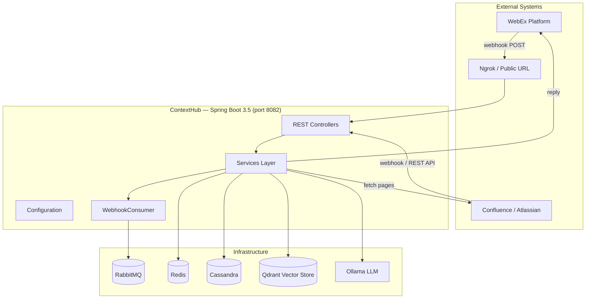
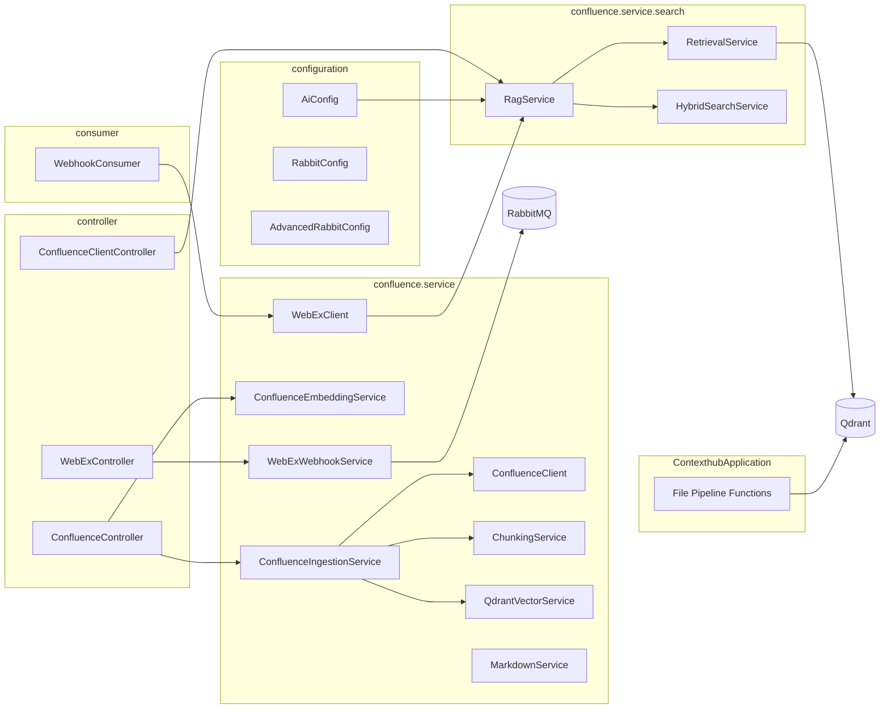
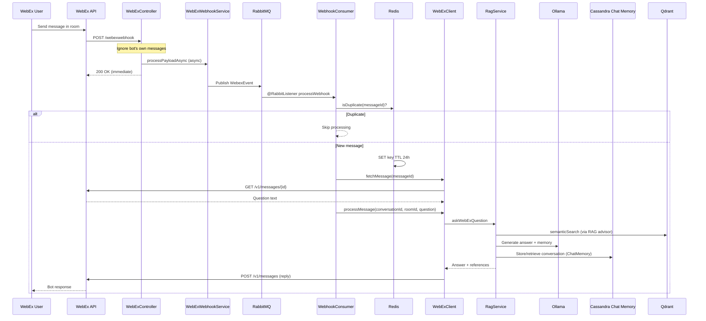
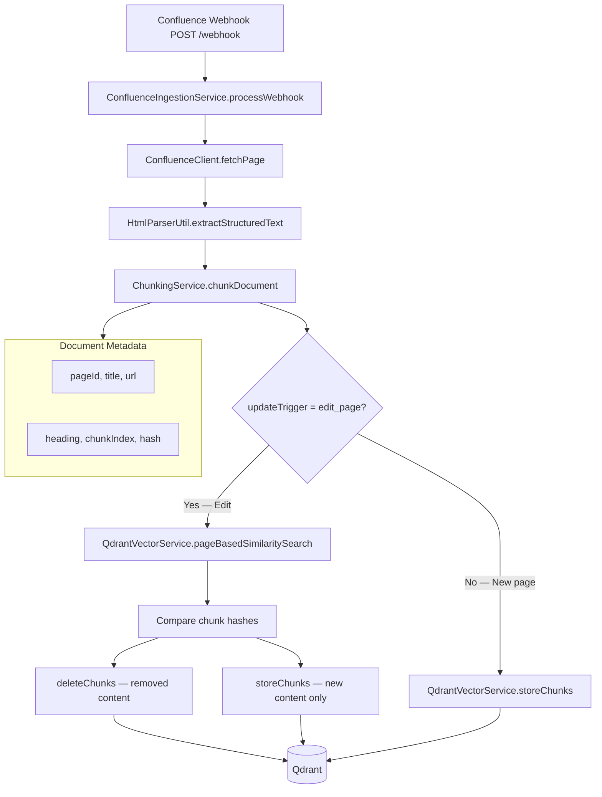
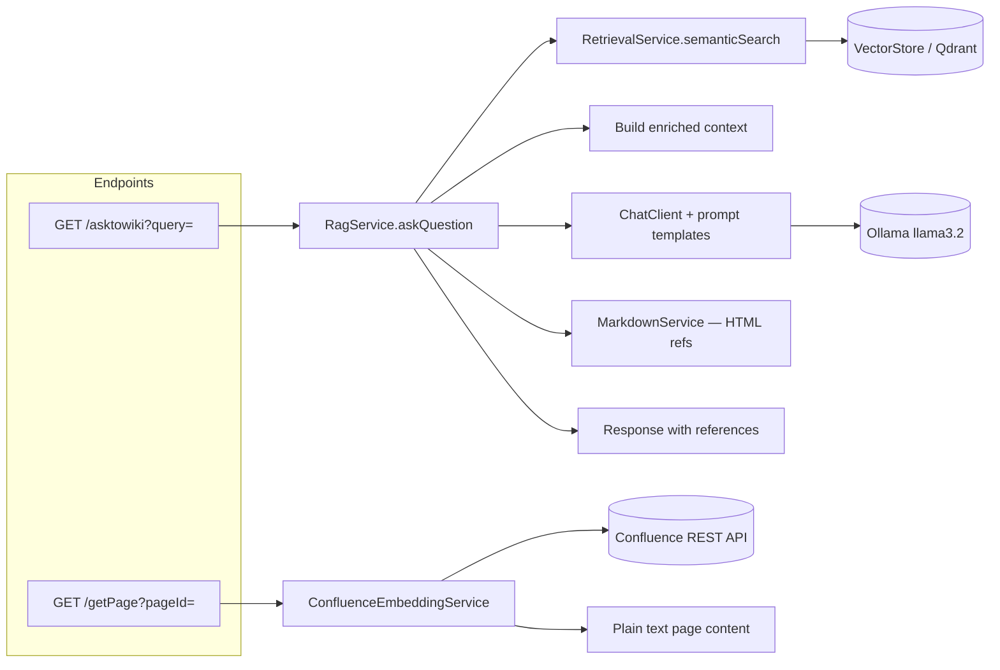
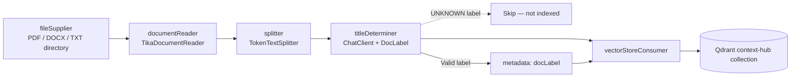
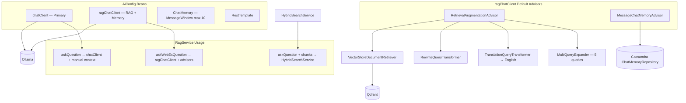
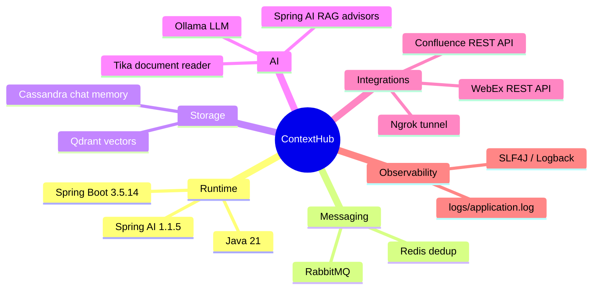

# ContextHub — System Block Diagram

Automated WebEx bot that answers questions from a Confluence knowledge base using RAG (Retrieval-Augmented Generation).

---

## 1. High-Level System Architecture



---

## 2. Application Layer (Java Packages)



---

## 3. WebEx Chat Bot Flow (Async + Queue)



---

## 4. Confluence Knowledge Ingestion Flow



---

## 5. Manual / REST Query Flow



---

## 6. File-Based Document Ingestion Pipeline

Runs at application startup via Spring Cloud Function composition.



**Pipeline definition** (`application.properties`):

`fileSupplier | documentReader | splitter | titleDeterminer | vectorStoreConsumer`

---

## 7. RAG & AI Configuration



---

## 8. Data Stores — Responsibilities

```mermaid
flowchart TB
    subgraph Qdrant["Qdrant (Vector Store)"]
        Q1[Collection: context-hub]
        Q2[Embeddings: mxbai-embed-large via Ollama]
        Q3[Confluence chunks + file documents]
    end

    subgraph Redis["Redis"]
        R1[Key: webhook:{messageId}]
        R2[TTL: 24 hours]
        R3[Purpose: deduplicate WebEx webhooks]
    end

    subgraph RabbitMQ["RabbitMQ"]
        M1[Exchange: webex.exchange]
        M2[Queue: webex.queue]
        M3[Routing: webex.routing.key]
        M4[Concurrency: 5–20 consumers]
    end

    subgraph Cassandra["Cassandra"]
        C1[Keyspace: contexthub]
        C2[Table: chat_memory]
        C3[Column: chat_messages]
        C4[TTL: 30 days]
        C5[Purpose: multi-turn WebEx conversation memory]
    end

    subgraph Ollama["Ollama"]
        O1[Chat: llama3.2:latest]
        O2[Embeddings: mxbai-embed-large]
    end
```

---

## 9. REST API Surface

| Method | Endpoint | Handler | Purpose |
|--------|----------|---------|---------|
| POST | `/webexwebhook` | WebExController | Receive WebEx message events |
| POST | `/webhook` | ConfluenceController | Confluence page create/update webhook |
| GET | `/getPage` | ConfluenceController | Fetch Confluence page text by `pageId` |
| GET | `/asktowiki` | ConfluenceClientController | Ask RAG question via HTTP (`query` param) |

---

## 10. Technology Stack Summary



---

## Component Dependency Matrix

| Component | Depends On |
|-----------|------------|
| WebExController | WebExWebhookService |
| WebExWebhookService | RabbitTemplate, Redis |
| WebhookConsumer | WebExClient, WebExWebhookService (dedup) |
| WebExClient | RestTemplate, RagService, WebEx API |
| RagService | ChatClient, ragChatClient, RetrievalService, HybridSearchService, MarkdownService |
| RetrievalService | VectorStore (Qdrant) |
| ConfluenceIngestionService | ConfluenceClient, ChunkingService, QdrantVectorService |
| QdrantVectorService | VectorStore |
| AiConfig | ChatModel, VectorStore, ChatMemoryRepository |
| ContexthubApplication | FunctionCatalog, VectorStore, ChatClient |

---

*Generated from codebase analysis. Render Mermaid diagrams in GitHub, VS Code (Mermaid extension), or [mermaid.live](https://mermaid.live).*
